# 
Portfolio

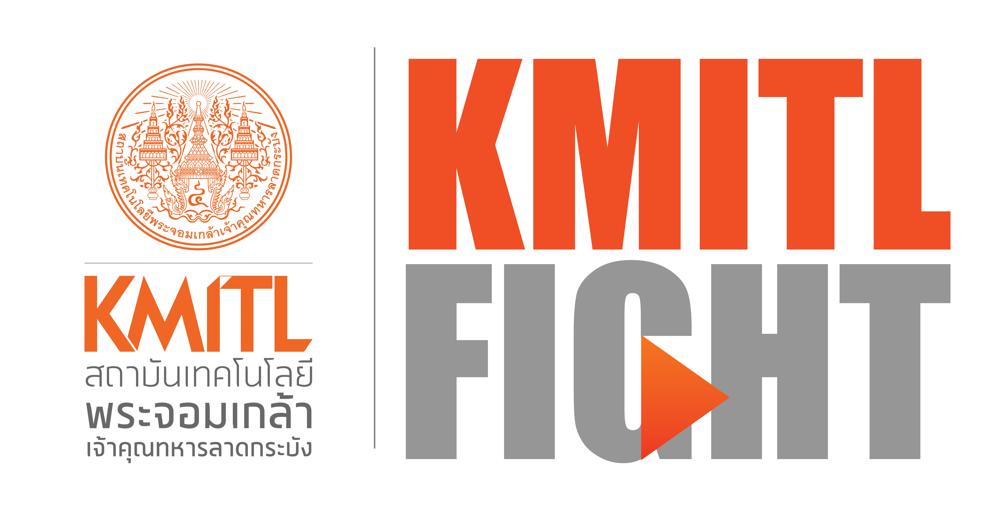

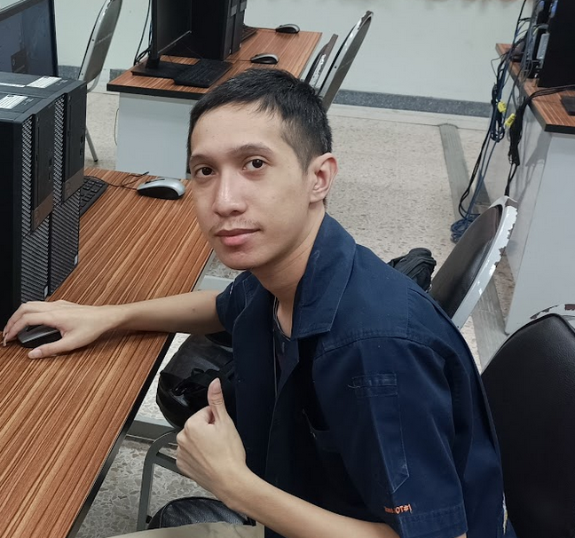

**Name**: Sethtakarn Peerasawetphong

**Education**: Bachelor of Engineering Major IoT System and Information Engineering at King Mongkut's Institute of Technology Ladkrabang

# Google Cloud learning activity with My Order

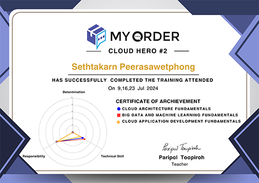

I learned how to write Google Cloud from My Order company, 
and also had the opportunity to try using the Cloud Shell system.

# Measurement of stair steps

The project is created to calculate the time spent on each 
step when going up or down a building.
The calculation of step measurements for ascending stairs is 
to simulate an evacuation scenario, such as escaping
to higher ground to avoid a tsunami, in order to determine 
how much time is needed to escape and survive.
The calculation of step measurements for descending stairs is to 
simulate an evacuation scenario,
such as escaping from a building to avoid a fire, in order to determine 
how much time is needed to escape and survive.

QR:GitHub

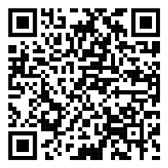

**Link**: [GitHub](https://github.com/baimai11/VerticalMap).

# Junk Scan

It is the scanning of the barcode on an item purchased from a store to 
determine what type of waste it is, so that we know which trash bin to dispose of it in.

**
Demonstration
**

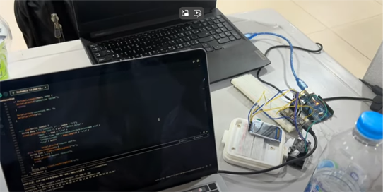

The first step is to scan the barcode 
from the plastic bottle.

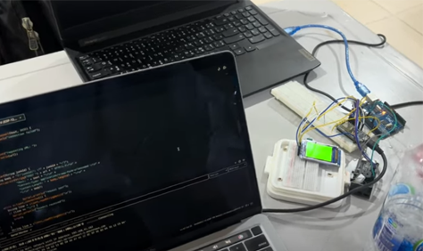

Once scanned, the result 
will be displayed on the screen.

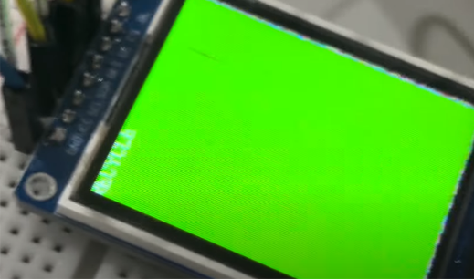

The result shows that the screen 
will turn green and display 
the word "Recycle," which means 
that this plastic bottle should be 
disposed of in the recycle bin.

# APRA & TIRT Thailand 2023

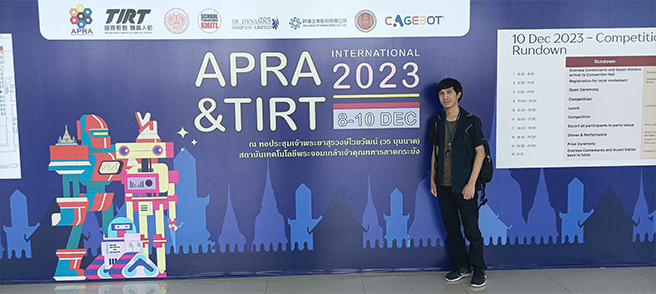

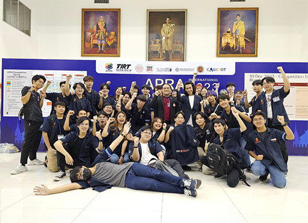

I participated in the event and served as a teacher assistant for the international robotics competition, which is a global 
robotics competition with participants 
from various countries such as 
Hong Kong, Taiwan, the Philippines, Malaysia, and more. The competition spans levels from 
elementary school, high school, 
vocational school, to university.

# K-Engineering World Tour and Workshop 2024

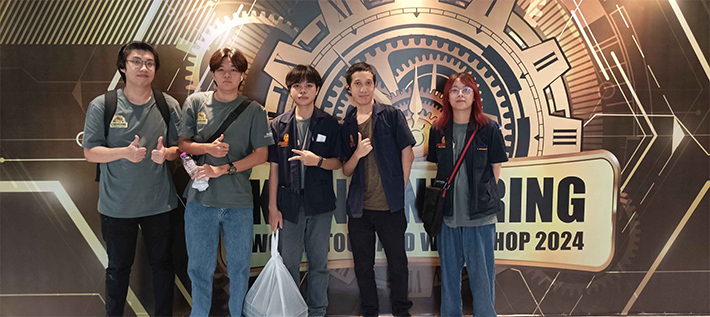

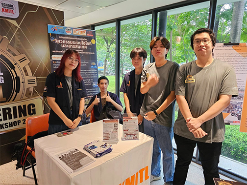

It is an activity to introduce the secondary students to the different engineering fields, explaining what each program is like, how to study them, and what kind of jobs they can pursue in the future after graduation.

# Keycard reader

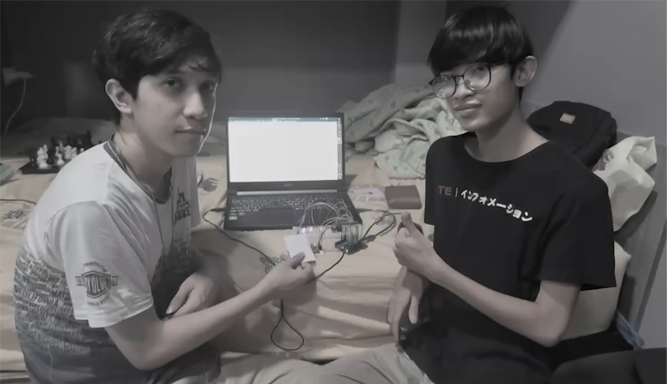

It is used to scan the keycard, similar to the principle of 
using a keycard to unlock a door, with RFID as the main technology.

**
Demonstration
**

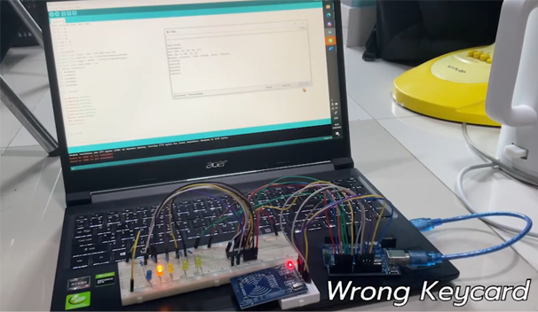

In case the card is incorrect,
if the card does not match or is 
invalid, the result will show that 
the blue light will not turn on.

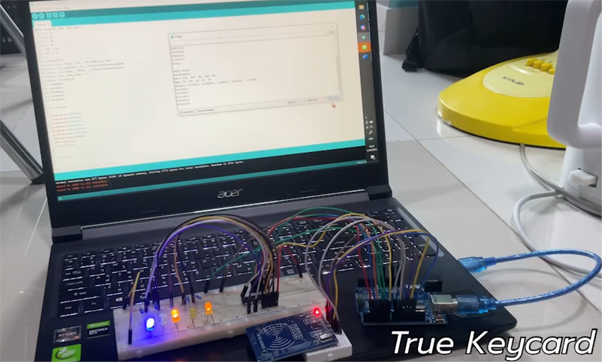

In case the card is correct, 
if the card matches or is valid, 
the result will show that 
the blue light will turn on.

# Internship Project

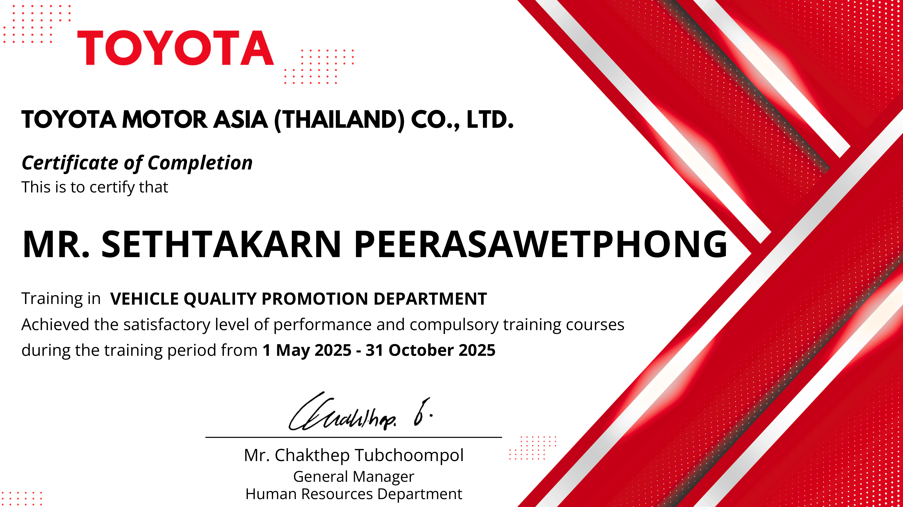

I completed a 6-month internship at 
Toyota and developed applications for 
the company using 
Microsoft Power Apps and 
Microsoft Power BI.

# Toyota Hackathon

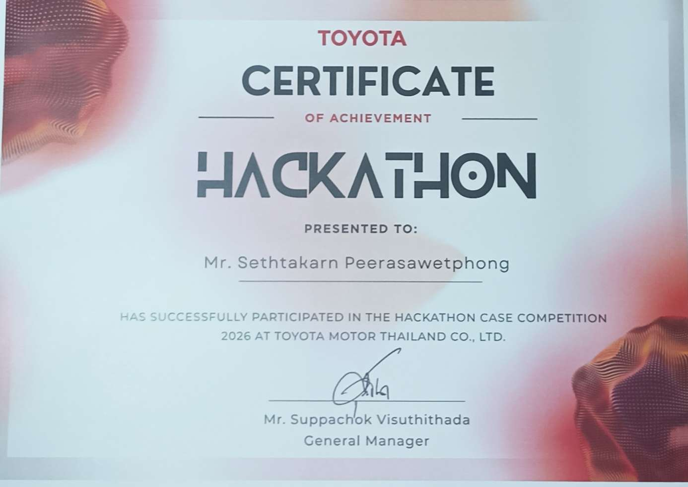

I participated in company activities, contributed to 
developing innovations within the company, and presented 
the projects to the company.